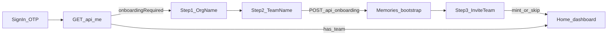

# Facilitator Onboarding

After registry OTP sign-in, facilitators with no `team_members` row enter a **three-step onboarding wizard** before using session tooling.

## Flow

| Step | UI | Server action |
|---|---|---|
| 1 | Organization name | Client-only state |
| 2 | Team name | `POST /api/onboarding` with `{ orgName, teamName }` |
| 3 | Invite your team | `POST /api/teams/:teamId/invites` on mount; copy link or skip |

Step 3 mints a shareable join link (`/join-team/{token}`). No email/SES in v1 — link-only, matching stub-registry local-dev posture.

## Gate

`GET /api/me` returns `{ user, teams[], onboardingRequired }`.

- `onboardingRequired: true` when the user has no `team_members` rows
- `App.tsx` renders `OnboardingWizard` until onboarding completes
- `POST /api/sessions` requires `teamId`; missing team returns `400` with `{ onboardingRequired: true }`

Silent org/team auto-create on session creation was removed.

## API surface

| Route | Auth | Purpose |
|---|---|---|
| `GET /api/me` | Registry session | Profile + team list + onboarding gate |
| `POST /api/onboarding` | Registry session | Create org, team, memories bootstrap (409 if already on a team) |
| `POST /api/teams/:teamId/invites` | Team member | Mint team join link |
| `GET /api/join-team/:token` | Public | Team/org names + invite status |
| `POST /api/join-team/:token/accept` | Registry session | Add user to `team_members` |

## Team invite vs session invite

| | Team invite | Session invite |
|---|---|---|
| Table | `team_invites` | `session_invites` |
| URL | `/join-team/{token}` | `/invite/{token}` |
| Effect | Adds `team_members` row | Binds stakeholder to a session interview |
| UI | `JoinTeamGate` | `InviteGate` |

Both reuse `hashInviteToken` / `generateInvitePlaintext` from `server/db/invites.ts`.

## Memories bootstrap

On successful `POST /api/onboarding`, `bootstrapOrgTeamMemories({ orgId, teamId, userId })` runs idempotently:

- Opens `memories/{orgId}.db` and `memories/{encodedUserId}.db` under `{EXEDRA_DATA_DIR}/memories/`
- Ensures scope chains per [namespaces.md](./namespaces.md)

User IDs (`did:key:…`) are encoded for filenames/paths only via `encodePrincipalIdForMemories` in `server/memories/encode-principal-id.ts`.

Requires `EXEDRA_MEMORIES_SQLCIPHER_KEY`.

## Client

- `client/lib/me-api.ts` — typed fetch wrappers
- `client/components/onboarding/onboarding-wizard.tsx` — three-step wizard
- `client/components/auth/join-team-gate.tsx` — deep link accept flow (mirrors `invite-gate.tsx`)

## Related

- [architecture.md](./architecture.md) — storage layout, auth, `server/memories/` module
- [entities.md](./entities.md) — org, team, team invite entities
- [repo-layout.md](./repo-layout.md) — file paths
