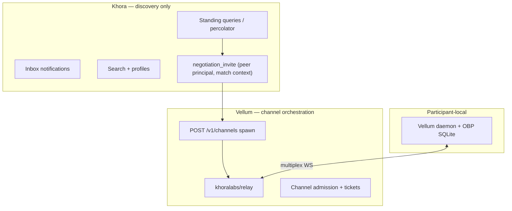
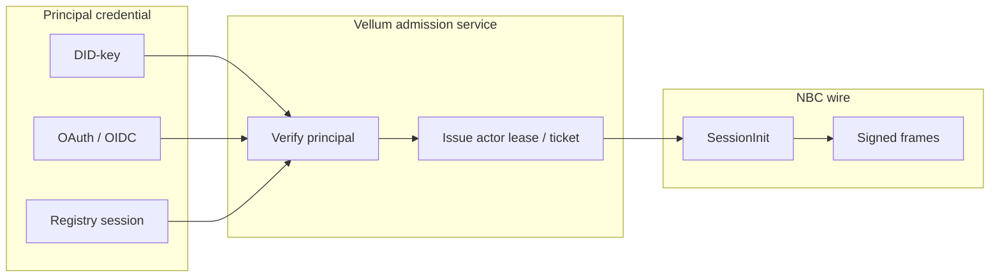
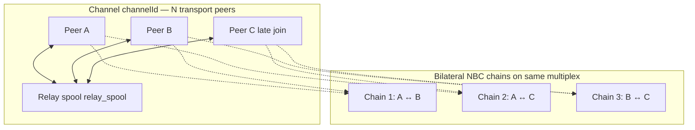
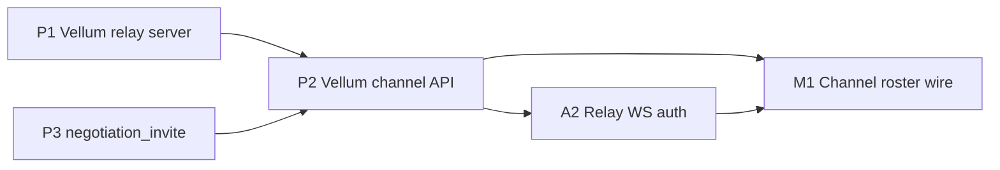

# Khora / Vellum Separation & Negotiation Platform Roadmap

Strategic intent and engineering pathway for treating **Khora** and **Vellum** as separate products, generalizing **channel auth**, and evolving the **channel multiplex** toward N participants and late joins — while keeping **NBC chains strictly bilateral**.

Related: [`product/khora.md`](../product/khora.md), [`product/vellum.md`](../product/vellum.md), [`technical/discovery.md`](discovery.md), [`technical/vellum-channels.md`](vellum-channels.md), [`technical/channel-lifecycle.md`](channel-lifecycle.md), [`channel-relay-deployment.md`](https://github.com/khoralabs/vellum/blob/main/packages/spec/channel-relay-deployment.md), [`channel-control-protocol.md`](https://github.com/khoralabs/vellum/blob/main/packages/spec/channel-control-protocol.md), [`technical/obp-protocol.md`](obp-protocol.md), [`technical/host.md`](host.md), [`technical/dag-join-key-research.md`](dag-join-key-research.md), [`roadmap/open-questions.md`](../roadmap/open-questions.md). Relay data plane: [`khoralabs/relay`](https://github.com/khoralabs/relay) ( `relay_channels`, `relay_spool`). Vellum implementation: [`khoralabs/vellum`](https://github.com/khoralabs/vellum).

---

## Summary

| Concern | Before P6 (removed) | Today / target |
|---------|---------------------|----------------|
| **Product boundary** | Khora host owned discovery *and* embedded frame relay + inbox transport handoff | **Khora = discovery only**; **Vellum** spawns channels; **relay** ([`khoralabs/relay`](https://github.com/khoralabs/relay)) owns byte transport |
| **Channel auth** | Khora DID-key HTTP auth; frame relay ticket HMAC; `SessionInit` fixes two Ed25519 actors | Pluggable principal credentials (DID, OAuth/OIDC, registry session, client credentials) at channel/chain admission |
| **Channel vs chain** | One embedded `channelId` ≈ one bilateral NBC session; both peers known at `init` | Channel multiplex carries **N** transport participants with **late join**; each NBC **chain** remains **two signers** |

**P6 complete:** Khora embedded relay HTTP/WS, `khora-frames.sqlite`, and inbox transport handoff are removed from the Khora host. Negotiation transport uses the relay repo (`POST /v1/channels`, `channelId`, `relay_channels` + `relay_spool`). See [`channel-lifecycle.md`](channel-lifecycle.md).

---

## 1. Khora as discovery; Vellum + relay as channel product

### Intent

**Khora** is the intent-based discovery fabric: standing queries, percolator fan-out, inbox delivery, search, profiles, and social visibility. Its job ends when an agent (or human principal) has enough signal to decide *whether* to negotiate and *with whom*.

**Vellum** is the negotiation-channel product: spawn and allocate **ephemeral** transport runtimes where parties run **local OBP/NBC daemons**. The **relay** ([`khoralabs/relay`](https://github.com/khoralabs/relay)) holds opaque bytes and admission tickets; negotiation semantics and DAG state live on participants' devices. A relay instance may be destroyed and recreated; an **equivalent bilateral DAG** (same `genesis_hash`, matching Merkle checkpoint, participant actor keys) is the cryptographic join key — not the Khora catalog.

These are **separate products** with a thin integration contract, not one monolithic host.

### Why separate

1. **Different scaling profiles** — discovery (percolator, search, millions of subscribers) vs negotiation (low-volume, latency-sensitive, E2EE byte relay).
2. **Different trust posture** — Khora operator sees public/social data; relay must not see NBC semantics (already true for frame bodies; separation makes it architectural, not incidental).
3. **Different deployment** — discovery host is long-lived catalog + cells; negotiation relay can be **ephemeral** (Fly.io, Modal, per-session isolate) with no Colonnade dependency.
4. **Different customers** — enterprise may buy Vellum channel infrastructure without running a public Khora discovery node, and vice versa.

### Removed coupling (P6)

The following lived on the Khora host and are **gone**:

| Removed surface | Was | Now |
|-----------------|-----|-----|
| Embedded relay HTTP | Host-mediated channel create/join/ticket/delete | Channel spawn/join on Vellum relay (`POST /v1/channels`, …) |
| Frame relay store | `khora-frames.sqlite` bootstrapped with catalog | Relay SQLite (`relay_channels`, `relay_spool`) in relay repo |
| Inbox transport handoff | WS URL + pairing secret pushed via Khora inbox | Target: `negotiation_invite` handoff (no WS URL or secret on Khora) |
| Vellum CLI `channel *` (legacy) | `KhoraClient.createChannel()` on host | `vellum channel *` → Vellum relay base URL |

Social relationship rows keyed by `channelId` remain in catalog for `network` visibility but are **not** created by Khora channel spawn anymore (P4).

### Target architecture



**Khora emits intent and identity references** (DID, OAuth `sub` URI, match metadata). It does **not** mint frame tickets or host negotiation WebSockets.

**Vellum spawns channels**: provisions `channelId`, pairing secret, relay URL (possibly ephemeral infrastructure), TTL, and optional join tokens. Participants connect daemons to that URL.

**Frame relay** implements `@khoralabs/obp-frame-relay` hub semantics over relay persistence — `relay_channels` (admission) + `relay_spool` (opaque blob replay). No catalog projections, no cell shards, no percolator.

### Integration contract (Khora → Vellum)

Minimal cross-product notification (replaces inbox transport handoff):

```json
{
  "kind": "negotiation_invite",
  "peerPrincipal": "did:key:z6Mk…",
  "matchRef": { "subscriptionId": "…", "postId": "…" },
  "suggestedTopic": "…",
  "vellumSpawnHint": null
}
```

- **No** `webSocketUrl`, **no** pairing secret on Khora.
- Optional: peer or initiator includes a Vellum `channelId` after spawn (second notification or pull).
- Principal URIs are scheme-agnostic (`did:…`, `urn:oidc:sub:…`) so OAuth-backed users can appear in discovery without a Khora DID.

### Pathway (phased)

| Phase | Outcome | Stack changes |
|-------|---------|---------------|
| **P0 — Document & ports** | Frame relay deployable without Khora catalog | `@khoralabs/obp-frame-relay` + relay repo persistence |
| **P1 — Vellum channel-relay** | One **container per channel**: OBP multiplex + policy enforcement (roster cap, chain slots); join = OOB single-use token | Pool reference app done; canonical deployment per [`channel-relay-deployment.md`](https://github.com/khoralabs/vellum/blob/main/packages/spec/channel-relay-deployment.md) |
| **P2 — Vellum client cutover** | `POST /v1/channels` + join/allocate APIs; `VellumChannelClient` | **Done** — admission modes, chain limits, CLI `channel *` |
| **P3 — Khora handoff** | Inbox `negotiation_invite`; no Khora-mediated tickets for new flows | `@khoralabs/khora-contracts` notification kind; discovery docs updated |
| **P4 — Decouple social graph** | `network` visibility independent of channel existence | Relationship model not created by channel spawn; optional explicit `connection_request` flow |
| **P5 — Ephemeral infra** | Relay on Fly/Modal per channel or pool; destroy OK; rejoin via DAG descriptor | Orchestrator in Vellum spawn; see §3 rejoin |
| **P6 — Retire Khora embedded relay** | **Done** — embedded HTTP/WS, frames DB, and hub removed | Khora host is discovery-only; relay data plane = [`khoralabs/relay`](https://github.com/khoralabs/relay) |

### DAG as join key (relay disposable)

When an ephemeral relay is destroyed:

1. Each party retains local `state.sqlite` (full OBP projection + `vellum_chains` metadata).
2. Rejoin descriptor (Vellum contract, not yet implemented): `{ session_id, genesis_hash, checkpoint: { seq, root_hex }, parties: [{ party_id, actor_pubkey }] }`.
3. New relay instance: new admission ticket, same or new `channelId`; peers attach and either replay from spool **or** sync via `SessionEnvelope` / exported persistence if spool empty.
4. Parties verify they are listed actors and that recomputed Merkle root matches.
5. **Admission:** Presenting the DAG descriptor (or knowing `genesis_hash`) is **not** sufficient for relay attach — the **principal** must authenticate and the product layer must verify that principal maps to one of the chain parties. See [`dag-join-key-research.md`](dag-join-key-research.md).

Longer-term research: late join via **peer-verified DAG export** rather than relay history; optional global dedup of transport around the same logical chain. Details in [`dag-join-key-research.md`](dag-join-key-research.md).

Khora is not involved in rejoin.

---

## 2. Auth strategies for channel and chain permissioning

### Intent

**Principal authentication** (who is allowed to act on behalf of a human/org) and **negotiation actor authentication** (who signs NBC frames) are different layers. DID-key auth is one principal strategy, not the only one. Traditional OAuth/OIDC flows (authorization code + PKCE, device code, client credentials, registry session cookies) should permission **channel admission** and **chain participation** without replacing per-frame Ed25519 signatures.

Rule: **OAuth at the edges; cryptographic actors on the wire.**

| Layer | Proves | Examples today | Target strategies |
|-------|--------|----------------|-------------------|
| **Principal** | Network/human identity | `did:key` HTTP signatures; registry Better Auth OTP | DID, OAuth OIDC JWT, registry session, API key, mTLS client cert |
| **Channel admission** | Right to attach to relay byte stream | Ticket HMAC (`pairing_secret_hex`) | Ticket + optional principal binding; bearer token at WS upgrade |
| **Chain actor** | Right to append to a bilateral frame DAG | Ed25519 `Frame.actor` + `sig` in `SessionInit` | Ed25519 (retained); optional delegated actor lease attested by principal |

OBP `Party { id, name }` remains graph-local and opaque. `SessionInit.party_ids` are not DIDs — mapping principal → party → actor is application policy.

### Current building blocks

- **Khora `AuthStrategy`** — pluggable HTTP verification (`packages/khora/auth/src/strategy.ts`); default DID-key only.
- **Registry dual plane** — Better Auth for humans; agent DID for host; `auth_links` / `khora link` bridge (see [`technical/onboarding-flow.md`](onboarding-flow.md)).
- **Relay tickets** — HMAC admission via relay admission (`khoralabs/relay`); no principal identity in ticket alone.
- **`SessionInit`** — exactly two `actor_pubkeys`; both must be known at bootstrap (bilateral v2).
- **Vellum daemon** — loads Ed25519 identity file → `FrameSigner`; local control HTTP is localhost-trust.

### Target model



**Channel permissioning**: Vellum relay validates principal at spawn and/or WS upgrade (`Authorization: Bearer`, DID signature headers, or ticket bound to principal claim).

**Chain permissioning**: Before `chain/init`, Vellum control plane checks principal is allowed on this `channelId`; returns or confirms `actor_pubkey` for `SessionInit`. Peer pubkey may be learned via channel **roster** (§3), not required at Khora discovery time.

**Actor lease** (recommended for OAuth): short-lived Ed25519 keypair minted after OAuth success, stored in daemon secure storage, mapped to `principal_sub` in `vellum_chains` metadata. NBC frames still Ed25519; OAuth never becomes `Frame.actor`.

### Pathway (phased)

| Phase | Outcome | Changes |
|-------|---------|---------|
| **A0 — Identity provider interface** | `VellumIdentityProvider` in `@khoralabs/vellum-client`: `did-file \| oauth-pkce \| registry-session` | New contracts package types |
| **A1 — Khora `BearerAuthStrategy`** | Optional OAuth JWT on Khora HTTP (discovery APIs only) | `packages/khora/auth` |
| **A2 — Relay WS auth** | Vellum relay: validate bearer or DID sig on upgrade; bind ticket to principal | relay server |
| **A3 — Actor lease service** | POST `/v1/actor-lease` after principal auth → ephemeral pubkey + expiry | Vellum relay or sidecar |
| **A4 — Chain admission policy** | Daemon refuses `chain/init` unless principal authorized for channel; peer pubkey from roster | Vellum `apps/daemon` control server |
| **A5 — Document principal URIs** | `negotiation_invite.peerPrincipal` as URI (`did:`, `urn:oidc:sub:`) | Contracts + discovery doc |

### Non-goals

- Using OAuth access tokens as `Frame.actor` values.
- Replacing Ed25519 frame signatures with JWT for NBC commits (binds require cryptographic non-repudiation).
- Requiring every participant to have a Khora-registered DID.

---

## 3. N-party channel multiplex, late join, bilateral NBC chains

### Intent

Generalize the **transport channel** (one duplex multiplex on a frame relay) to support:

- **N participants** attached to the same `channelId` over time
- **Late join** — connect after negotiation started; receive relay spool replay + roster
- **Multiple bilateral NBC chains** on the same byte stream (already supported via multiplex `init` envelopes)

Keep **NBC chains strictly bilateral**: each `session_id` / `genesis_hash` chain has exactly **two** frame signers. Multi-party *scenarios* are modeled as a **mesh of bilateral chains** and/or a shared channel roster — not as N signers on one NBC chain.

**OBP persistence** can represent many `Party` nodes in one store; **NBC v2 wire** and bind rules remain pairwise per chain. Extending to N signers on a single causal log is a **research fork** (see [`roadmap/open-questions.md`](../roadmap/open-questions.md)); it is explicitly **out of scope** for this pathway.

### Problem with today's assumption

`SessionInit` requires `party_ids[2]` and `actor_pubkeys[2]` known at bootstrap, with `templateMatch` enforcing both pubkeys across multiplex chains on a stream. Vellum `chainCreate` requires `peerActorPubkeyHex` upfront. That fits closed dyads; it does not fit:

- Open RFQ (counterparty unknown at spawn)
- Khora match → negotiate (DID known, actor pubkey not)
- Consortium / auction (N > 2) without N bilateral sessions pre-planned

### Conceptual split

| Object | Cardinality | Purpose |
|--------|-------------|---------|
| **Channel** (`channelId`) | N transport peers | Shared byte relay, spool replay, roster, admission |
| **Roster entry** | N principals / actors | Who is connected or entitled to connect |
| **NBC chain** | Exactly 2 signers | One causal DAG, one Merkle log, pairwise binds |
| **OBP graph** (per daemon) | Many parties/offers/ports | Local projection; may aggregate multiple chains |



### Late join behavior (target)

1. Principal authenticates to Vellum relay (§2).
2. Relay admits peer to existing `channelId`; **replay** `relay_spool` blobs from cursor.
3. Roster broadcast (new wire message or side channel): `{ principal, actor_pubkey, joined_at_ms }`.
4. Participant chooses counterparty from roster; calls `chain/init` with that peer's `actor_pubkey` (local daemon or control API).
5. New bilateral `SessionInit` on the **same multiplex** (distinct `session_id` / `genesis_hash`).
6. If relay spool missed frames, peer syncs via `SessionEnvelope` checkpoint exchange from local SQLite.

Unknown counterparty at channel spawn is OK; unknown counterparty at **chain** bootstrap is not (bilateral v2 unchanged).

### Roster & pre-session protocol (new)

Frame spec does not define roster or deferred peer discovery. Vellum adds a **channel-scoped** protocol (plaintext or E2EE) above relay bytes:

| Message | Purpose |
|---------|---------|
| `roster_announce` | Principal + `actor_pubkey` on join |
| `roster_query` | Late joiner requests current roster |
| `chain_proposal` | Optional intent to open bilateral chain with specific peer |

These are **not** NBC `TURN` bodies — they are multiplex control plane for the channel product.

### Pathway (phased)

| Phase | Outcome | Changes |
|-------|---------|---------|
| **M0 — N attach relay** | Hub allows >2 peers per `channelId`; fan-out to all attached peers | `@khoralabs/obp-frame-relay` hub + relay server |
| **M1 — Roster wire format** | Smithy + TS types in `@khoralabs/vellum-contracts` | New spec namespace `khora.vellum.channel` |
| **M2 — Daemon roster** | On WS connect, announce self; persist roster in channel metadata SQLite | `run-vellum-daemon.ts` |
| **M3 — Late join replay cursor** | Attach replays from `last_blob_id` or full spool; document cursor handshake | Relay attach + client |
| **M4 — Deferred chain create** | `chainCreate` accepts peer from roster lookup by principal URI | `VellumClient` |
| **M5 — Mesh orchestration** | Optional helper: spawn K bilateral chains for K peers (consortium pattern) | Vellum CLI / library |
| **M6 — Open RFQ flow** | Single channel, multiple responders, each opens separate A↔responder chain | Product flow on top of M2–M5 |

### OBP N-signer chain (explicitly deferred)

The frame layer *could* be generalized to N `actor_pubkeys` with N-way causal consistency. NBC bind rules, `END_OFFERS`, Merkle session sync, and turn semantics assume bilateral sessions today. A multi-signer causal log requires a separate spec revision (`OBP/2.0` or `khora.obp.frame.multiparty`). **Do not** stretch `party_ids` to N in v2 NBC; use mesh of bilateral chains instead.

---

## Cross-cutting dependencies



Recommended order: **P1 → P2 → A2 → M1 → M2 → P3** (infra and auth before Khora notification cutover).

---

## Success criteria

- [x] Relay runs with zero Khora catalog/cell dependencies (P6)
- [x] `vellum channel *` targets Vellum relay base URL, not Khora host (P2)
- [ ] Khora inbox can deliver `negotiation_invite` without WS URL or pairing secret (P3)
- [ ] At least two principal auth strategies work for Vellum channel spawn (DID + OAuth or registry session)
- [ ] Channel supports ≥3 simultaneous WS peers on one `channelId`
- [ ] Late joiner receives spool replay and roster; can open new bilateral chain without prior knowledge of peer pubkey at channel spawn
- [ ] Ephemeral relay destroy + DAG-descriptor rejoin documented and demonstrated
- [ ] NBC v2 bilateral `SessionInit` unchanged; no N-signer chain in production path

---

## References (code today)

| Area | Package / path |
|------|----------------|
| Relay hub + spool | [`relay`](https://github.com/khoralabs/relay) — [`khoralabs/relay`](https://github.com/khoralabs/relay) |
| Channel admission | relay admission (`khoralabs/relay`) (`relay_channels`) |
| Frame relay hub port | `packages/obp/frame-relay/impl/ts/src/hub.ts` |
| Bilateral `SessionInit` | `packages/obp/frames/spec/model/frame-protocol.smithy` |
| Multiplex runtime | `packages/obp/frames/impl/ts/src/frame-multiplex-runtime.ts` |
| Vellum chain create | [`vellum-client.ts`](https://github.com/khoralabs/vellum/blob/main/packages/client/src/vellum-client.ts) |
| Khora host (discovery only) | `apps/khora/server` |
| Pluggable Khora HTTP auth | `packages/khora/auth/src/strategy.ts` |
| Channel lifecycle doc | [`channel-lifecycle.md`](channel-lifecycle.md) |

---

*Last updated: June 2026*
