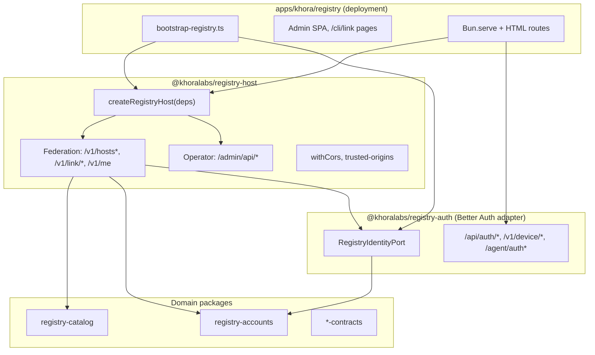

# Registry — Internal Architecture

Three layers mirror the khora-server pattern: **library composes federation**; **app bootstraps deps and serves HTTP**.



## Package boundaries

| Layer | Package | Owns | Does not own |
|-------|---------|------|--------------|
| **Contracts** | `registry-catalog-contracts`, `registry-accounts-contracts` | `Account`, memberships, host catalog, link wire shapes | Better Auth, ceremony row types |
| **Domain CRUD** | `registry-catalog`, `registry-accounts` | Federation persistence + CRUD; ceremony helpers internal | HTTP, Better Auth |
| **Identity adapter** | `registry-auth` | Better Auth, session port, OTP/SES, IdP HTTP routes | Host catalog, link protocol |
| **Federation host** | `registry-host` | `createRegistryHost`, federation + operator HTTP, CORS | Better Auth, SPAs, env reads |
| **Deployment app** | `apps/khora/registry` | `bootstrap-registry.ts`, Litestream, HTML routes, marketing | Inline route table |

**Single database:** encrypted SQLite at `REGISTRY_DATABASE_PATH`, opened via `getRegistryDatabase()`.

**Dependency direction:**

```
apps/khora/registry → registry-host, registry-auth, khora-console

registry-host → registry-catalog, registry-accounts, *-contracts, khora-auth (link DID verify)
              → NO better-auth

registry-auth → better-auth, registry-accounts, registry-catalog
              → implements RegistryIdentityPort (types from registry-host)

registry-catalog / registry-accounts → NO registry-auth, NO better-auth
```

---

## Authentication

Better Auth with `emailOTP`. App bootstrap wires:

- `createBetterAuthRegistryIdentity({ resolveTrustedOrigins })` → `RegistryIdentityPort`
- `createBetterAuthRegistryRoutes({ db, identity, publicUrl, ... })` → IdP HTTP dispatch

Federation handlers call `identity.getSession(req)` instead of importing Better Auth directly.

After trusted-origin admin approval, host calls `identity.reloadTrustedOrigins?.()`.

Ceremony persistence (`device_authorizations`, `agent_auth_registrations`) lives in domain schema but types are **internal** to `registry-accounts` (`ceremony-types.ts`), not exported from contracts.

---

## HTTP surface (by prefix)

| Prefix | Layer | Auth | Purpose |
|--------|-------|------|---------|
| `/api/auth/*` | registry-auth | Better Auth | Sign-in, sessions, OTP |
| `/v1/device/*`, `/agent/auth*`, `/.well-known/oauth-*` | registry-auth | Device / claim | CLI device flow, auth.md agent register |
| `/v1/me`, `/v1/hosts*`, `/v1/link/*` | registry-host | Session / public | Federation catalog + linking |
| `/admin/api/*` | registry-host | Console token | Operator console API |
| `/v1/marketing/*` | registry app | None | List subscribe/unsubscribe (khoralabs growth) |
| `/admin`, `/cli/link` | registry app | Static SPA | Operator UI, link UX |

---

## Bootstrap

`apps/khora/registry/src/bootstrap-registry.ts`:

1. `assertEncryptionKeys`
2. `ensureRegistrySchema`
3. `createBetterAuthRegistryIdentity` + `createBetterAuthRegistryRoutes`
4. `createRegistryHost({ db, identity, consoleAuth, publicUrl, resolveTrustedOrigins })`

`index.ts` dispatch order: `identityRoutes.handle` → marketing → `host.fetch` → 404.

---

## Domain inventory

### Hosts catalog
Self-serve register, claim, operator activate, public catalog. Health poller started by `createRegistryHost`.

### Agent links (CLI / DID)
Device + browser link, auth.md register/claim, DID challenge link, status/unlink.

### Trusted origins
Participating hosts contribute explicit origins to registry CORS and Better Auth via `readRegistryTrustedOrigins` + identity reload.

---

## Package file map

**Registry app:** `src/bootstrap-registry.ts`, `src/index.ts`, `src/api/marketing.ts`, admin/cli HTML routes

**registry-host:** `src/create-registry-host.ts`, `src/fetch.ts`, `src/routes/*`, `src/cors.ts`, `src/trusted-origins.ts`, `src/host-health.ts`, `src/ports/identity.ts`

**registry-auth:** `src/better-auth-identity.ts`, `src/better-auth-routes.ts`, `src/routes/device.ts`, `src/routes/agent-auth.ts`, `src/auth-config.ts`, `src/session.ts`

**registry-accounts / registry-catalog:** domain CRUD + `schema-sql.ts` (federation vs ceremony DDL sections)
