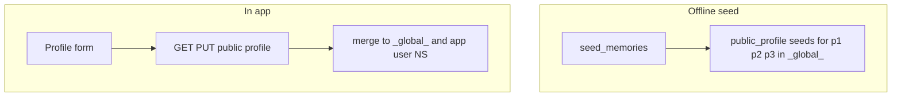

# Global public profiles and user-built profile

## A. Offline: seed simulated personas into `_global_` (unchanged intent)

- **Namespace:** `obp_demo/matchmaking/subjects/{subjectId}/_global_` via e.g. [`matchmakingGlobalMemoryNamespace`](apps/matchmaking/src/lib/memories/) (new helper, mirroring [matchmakingPersonaMemoryNamespace](apps/matchmaking/src/lib/memories/matchmaking-persona-memory-namespace.ts)).
- **Payload:** extend [`zMeetingSeedPayload` / `MeetingSeedPayload`](apps/matchmaking/src/lib/memories/meeting-seed-payload.ts) with `kind: "public_profile"`, fields `slug`, `displayName`, `tagline`, `about` (align with [`PersonaPublicDto`](apps/matchmaking/src/lib/persona-public-dtos.ts) public fields, excluding runtime-only `agentId` / wire-only display resolution).
- **Seeding:** [`seedGlobalPublicProfiles`](apps/matchmaking/src/lib/memories/seed-personas.ts) (or adjacent module) iterates [matchmakingPersonas](apps/matchmaking/src/lib/personas/index.ts) in stable order; [`mergeMeetingDomainPayloadIntoNamespace`](apps/matchmaking/src/lib/memories/merge-meeting-payload.ts) with keys like `seed/public-profile/{slug}`; idempotent `skipExistingSlots` matching [seedPersonaMemoryNamespace](apps/matchmaking/src/lib/memories/seed-personas.ts). Call from [`seedAllMatchmakingPersonaMemories`](apps/matchmaking/src/lib/memories/seed-personas.ts) so [`seed-memories` CLI](apps/matchmaking/src/lib/seed-memories-cli.ts) runs it.
- **Values:** from each persona’s `displayName` and `profile` (not `resolveMatchmakingNegotiatorDisplayName` in the stored payload) so the graph matches authored cards.

## B. In-app: experiential user builds their public profile

**Product:** The human can set **display name, tagline, and about** (same shape as sim cards for consistency). This is not a p1/p2/p3 module; it is the user’s own card for discoverability and for their agent’s context.

**Storage (recommended):**
- **Merge the same** `public_profile` payload with **reserved** `slug` (e.g. `_user_` to match [APP_USER_REQUESTER_SLUG](apps/matchmaking/src/index.ts) / [matchmakingUserNamespaceSegment](apps/matchmaking/src/lib/memories/app-user-memory-namespace.ts) default) into:
  1. **`_global_`** so all public directory entries (sims + user) share one search namespace, under e.g. `live/public-profile/{slug}` to distinguish from `seed/...` rows.
  2. **App user memory namespace** ([`appUserMemoryNamespace`](apps/matchmaking/src/lib/memories/app-user-memory-namespace.ts)) with the same or paired key so Party A’s negotiator tools see the user’s public story alongside invite/reflection memories.

**API** (in [apps/matchmaking/src/index.ts](apps/matchmaking/src/index.ts) or a small module):
- **`GET`:** return current public profile for the app user—either from SQLite/JSONL by stable memory key (requires read path on [MatchmakingMemoriesBundle](apps/matchmaking/src/lib/memories/create-memories-bundle.ts) or persistence) or return defaults when missing.
- **`PUT` or `POST`:** zod-validate `displayName`, `tagline`, `about` (sensible max lengths), then background/async merge like [post-negotiation-kg](apps/matchmaking/src/lib/post-negotiation-kg.ts) (or sync if acceptable for the demo) using the same `mergeMeetingDomainPayloadIntoNamespace` + chat/embedding as other live merges.

**UI** ( [App.tsx](apps/matchmaking/src/App.tsx) / small components):
- Entry point: e.g. new phase `"profile"` or a **My profile** sheet from the list screen (minimal chrome, use existing design primitives).
- Form: three fields + Save; show load errors; optional success toast/inline confirmation.
- **Browse list** ([`GET /api/personas`](apps/matchmaking/src/index.ts)): product choice—either (1) add the user’s row to the list by merging DTO with `listPersonaPublicDtos` + a synthetic row from GET profile, or (2) keep sim-only list and show “Your profile” only in the profile editor. **Plan default:** include a **“You”** card or separate strip when profile is set, so the feature is visible without only editing.

## C. Docs and tests

- [apps/README.md](apps/README.md): `seed-memories` populates `_global_` for sims; `USER` / profile API updates live merges for the experiential user.
- Tests: global path shape; `public_profile` zod; optional handler test for validation.

## Flow (high level)

## Out of scope (unless pulled in later)

- Other parties “searching” the user’s card in negotiation (can reuse `_global_` in prompts later).
- Auth/multi-tenant subjects beyond existing `resolveMatchmakingSubjectId` behavior.
