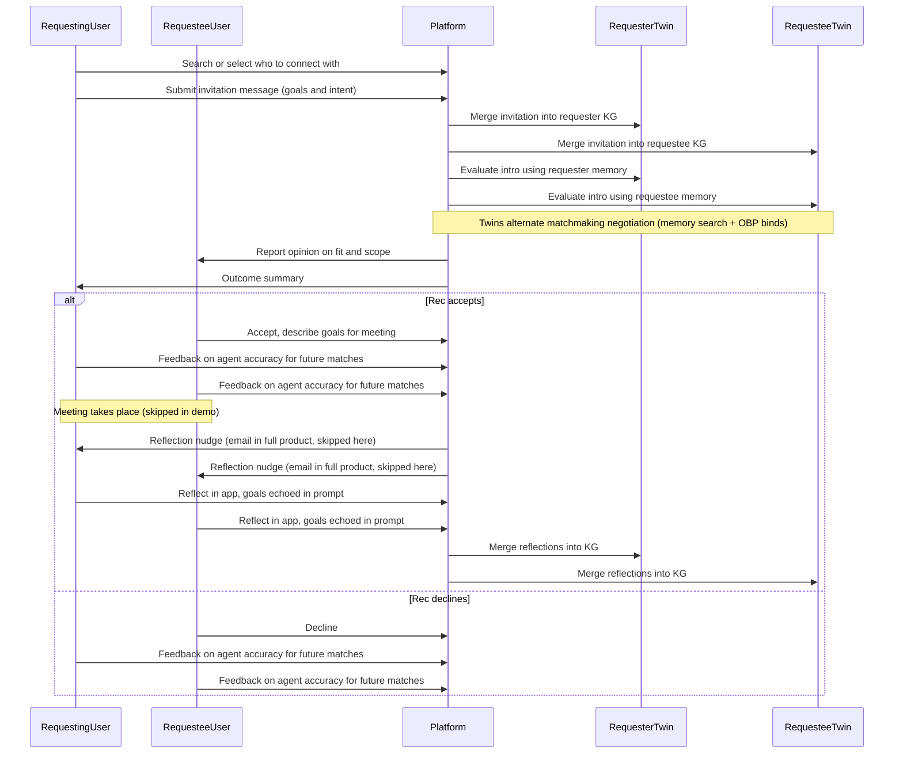

# BrewChat: post-session engagement demo

## What this is

BrewChat is a networking platform for short, scheduled coffee chats — students to professionals, professionals to peers, with explicit intent on every request. The product brief asked for a post-session engagement feature: something that captures the value of a good conversation, feeds it back into the platform, and brings people back.

Early data: 100% of users submit a message of intent with their booking request, most are descriptive, and users who return within 48 hours of a session are significantly more likely to book again. The interesting question is what understanding you can build from a user's accumulated intents and reflections, and how that understanding improves the next match.

This repo implements a working demo of that loop.


## The four design principles

### 1. Personal understanding

Build a picture of each user from their goals and experiences. In the matchmaking demo: the app user builds an experiential graph from interactions, while five simulated directory personas are offline-seeded for browse/invite.

### 2. Reflection as a product

After a connection, capturing what happened should feel useful — roughly CRM-light for people who treat chats as leads. The demo's reflection step keeps the original goals in view so the notes are grounded rather than free-floating.

### 3. Evaluate the intro but don't hard-gate it

Use both parties' history to form an opinion about whether a meeting is a good use of time, but don't block the connection outright. When a user pushes back on the agent's assessment, that pushback is signal that is fed back into the system to improve future performance.

### 4. Great connections from why

The system should care why someone is looking. Agents read memory before committing, and the prompt stack nudges them to compare the intro to past intents.


## The personal knowledge graph and virtual twin

Each user has a personal knowledge graph grown from their intents and reflections — people, places, observations, beliefs, and whatever else matters to them. Plain semantic search can rank "relevant" intros, but the interesting part is using that graph so an agent can reason about fit using each user's meaning rather than only global embeddings.

The ontology is intentionally domain-light: `person`, `place`, `preference`, `event`, `fact`, `observation`, `belief`, `temporal` as node labels; `references`, `affects`, `causes`, `describes`, `before`, `after`, `during`, `includes` as edge labels. Each label has a Zod props schema so merges stay typed. This is a pragmatic starting point but there's honest tension between a fixed, typed ontology that's good for search quality and a looser, user-relative graph that's better for personal meaning as the platform matures.


## Demo loop

```
request chat → explain goals → confirm
  → merge invitation into both personal KGs
  → evaluate the intro (both twins, alternating negotiation turns)
  → report fit opinion to requestee

  if requestee accepts:
    both parties give feedback on how the agent represented them
    → meeting takes place
    → nudge both to reflect, original goals echoed in prompt
    → merge reflections into both KGs

  if requestee declines:
    both parties still give feedback on agent accuracy
    → merge feedback into both KGs
```

The invitation text is first-class: once the requester confirms, the platform merges it into each party's memory namespace so both twins ground later negotiation and reflection on the same articulated intent. On either branch — accept or decline — both parties can correct the agent's read of them. That feedback is signal regardless of outcome: a decline with a correction tells the system more about a user's actual goals than a silent accept would.

In a shipped product, the reflection nudge would arrive as an email with two paths: reply in-thread for quick notes which are ingested as a payload, or a deep link into the app. That email and webhook plumbing is out of scope here; the demo shows the data flow, not the delivery mechanism.



Explicitly out of scope: Zoom integration, Supabase/Next production stack, post-call email or inbound reply parsing, calendar webhooks. Personas stand in for real users.


## Technical decisions

### Runtime and server

`apps/matchmaking` is a Bun app: `Bun.serve` with an HTML-import client, a small JSON API, and a WebSocket for dev visibility. That's a convenience for a fast local walkthrough, not a statement about production hosting.

### Two-party negotiation

Turns alternate over a shared plaintext thread plus a small orchestration note so each side knows seat order. Under the hood this composes three packages: Agent identity (registered negotiators, per-turn session runner), OBP (parties, offers, ports, bind lifecycle), and Memories (per-party namespaces, `memory_search`). Commitments stay structured; the thread is a human-readable transcript, not the source of truth.

### Per-user twin

Each persona gets a memory namespace backed by SQLite via `createMatchmakingMemoriesBundle`. A JSONL lexical mirror is written per namespace alongside SQLite so the graph is inspectable and replayable without a database client.

### Matchmaking: global public directory

Running `bun run seed-memories` in `apps/matchmaking` seeds the usual per-persona meeting rows and, in a shared **`_global_` namespace** under `obp_demo/matchmaking/subjects/{subjectId}/_global_`, one **`public_profile`** memory per simulated persona (name, tagline, about) for directory-style search. The human can use **My profile** in the UI: **`GET` / `PUT` `/api/me/public-profile`** merges the same `public_profile` shape into both `_global_` and the experiential user memory namespace. A `user-public-profile.json` file under the memories root mirrors the form state for reliable loading (implementation detail; the memory merges are the graph source for agents).

### Structured commitment layer

OBP state uses `ObpClient` over `@cfd/obp-sqlite`. Each UI run persists the graph under `OBP_DIR/runId/obp.sqlite` by default; set `OBP_MEMORY=1` for an in-memory run (useful in CI). An optional `obp-steps.jsonl` records append-only mutation envelopes when the dev drawer is open or `OBP_STEP_LOG=1` is set — this is a debug trace, not a second source of truth.

### LLM

Negotiation uses Gemini through the `ai` SDK and `@ai-sdk/google`. Gemini-only keeps integration simple; multi-model is a product decision, not an architectural constraint.

### Frontend

The React/Radix/Tailwind shell in `apps/matchmaking` is demo chrome. The core packages — OBP, Memories, Agent identity, and `runMatchmakingSession` — don't care about the shell. The same flows could run under Next.js or any other host; only routing and rendering would change.


## Core packages

### Offer Binding Protocol (OBP)

A small set of primitives for structured negotiation: parties, offers, ports, bind lifecycle, expiry, and graph reads. `ObpClient` validates invariants then delegates to `ObpPersistence`, keeping negotiation logic separate from storage. Higher layers use `@cfd/obp-negotiator` and `@cfd/obp-tools`. Runs are recorded and replayable through the same validate-then-delegate shape used in Memories.

### Memories

A hybrid lexical / vector / graph store. `MemoriesClient` takes a typed ontology and validates merges. Search fuses lexical and vector arms with Reciprocal Rank Fusion. The core client can omit a store; matchmaking always sets one (JSONL via `@cfd/memories-stores`) so lexical export is mirrored for source maps and debugging. Adapters, tools, and the integrator package are how negotiator code searches and mutates memories in a session.

### Agent identity

Ties who an agent is (instructions, static context, toolkits) to what it can do this turn (affordances, policy) so sessions see one coherent identity instead of a collection of disconnected tools. `createRegisteredAgentIdentity` folds instructions plus a root composable into a `RegisteredAgentIdentity` and `staticHash`. The OBP negotiator plugs in so each turn is "same registered agent, fresh `resolveEnv`."

### Supporting packages

`@cfd/agent-thread` formats the shared thread and mirrors generations into it. `@cfd/agent-identity-adapters` handles identity construction. Everything else in the matchmaking `package.json` is UI or dev tooling.

Minimal mental model: UserInvite → `runMatchmakingSession` → RegisteredAgent + ObpClient + MemoriesClient → result and transcript.


## Tradeoffs

- OBP on disk per `runId` keeps each invite's graph inspectable without extra tooling. `OBP_MEMORY=1` restores hermetic in-memory behavior for CI. Production would move toward shared tenancy, audit, and a retention policy.

- Gemini-only keeps this slice simple. Multi-model or fallback is a product decision and nothing in the architecture blocks it.

- Synthetic personas let the demo tune seeds and show failure modes without touching PII.

- Opinionated negotiation, not a hard gate — matches the product principle. The model can decline or counter scope; the human story is "steer your twin," not "the algorithm said no."

- Canonical ontology today vs domain-agnostic, user-relative meaning tomorrow — honest tension. The demo optimizes for typed merges and search quality on a known schema.

- Local SQLite is a convenience. Both persistence interfaces (`ObpPersistence`, `MemoriesPersistence`) exist precisely so storage can go cloud-shaped when ready — managed SQL, search services, object stores — without rewriting negotiation or merge/search logic.


## If I had more time

- Real post-session trigger (Zoom-shaped webhook)
- Email nudge with reply-to-reflect path
- Deeper analytics on repeat intent patterns
- Process mining to surface usage patterns across the user graph
