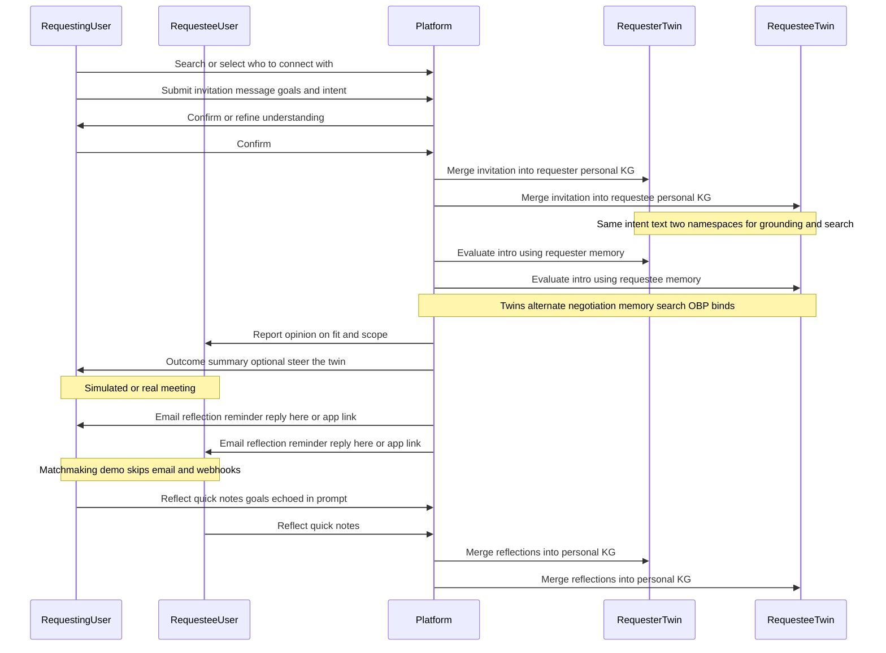

# Project decisions: BrewChat angle and the matchmaking demo

Based on early signals, people use BrewChat when they need something. The product win is getting better at understanding **what** they need right now and **why** those needs exist. That understanding will allow us to make, personal, contextually relevant matches and follow-ups. Basic plumbing for building that understanding is already present. 100% of early users provide a message with their invite to conenct. Those messages, coupled with the profile of the person they want to connect with, encode rich information about users' intent. This information is traditionally difficult to piece together on social networks; so this is a big advantage for BrewChat.

---

## Product angle (four principles + mental model)

These are the four ideas I’ve been using; in the demo each one has a rough counterpart.

1. **Personal understanding** — Build a picture of each user from goals and experiences. In the demo: seeded personas + ongoing memory graph per party, not a blank model every request.

2. **Reflection as a product** — After a connection, capturing what happened should feel useful (almost CRM-light for people who treat chats as leads). In the demo: the loop explicitly includes a reflection step with the original goals still in view.

3. **Evaluate the intro but don’t hard-gate it** — Use both parties’ history to say whether a meeting is likely a good use of time, but don’t block connect outright. The pushback from the user about the agent's decision becomes signal that makes the agent better in the future.

4. **Great connections from *why*** — Surface-level keywords aren’t enough; the system should care why someone is looking. In the demo: agents read memory before committing, and the prompt stack nudges them to compare the intro to past intents.

**Personal KG + virtual twin.** I’m thinking of a **personal knowledge graph** per user, grown from intents and what they report back (people, places, observations, beliefs, and whatever else matters to *them*). Plain semantic search can rank “relevant” intros, but the interesting part is using that graph so an agent can reason about fit using each user's meaning rather than only global embeddings.

**Ontology stance.** The personal KG should stay mostly domain-agnostic, with a loose ontology that can shift with personal meaning. In this repo the memories stack uses a canonical, typed ontology (Zod-validated merges) as a pragmatic starting point. The default vocabulary lives in [`packages/memories/core/src/ontologies/cannonical.ts`](packages/memories/core/src/ontologies/cannonical.ts) (`defineOntology`): it’s meant as a domain-light “people, places, time, facts, and how they relate” graph, not the final word on personal meaning.

- **Node labels:** `person`, `place`, `preference`, `event`, `fact`, `observation`, `belief`, `temporal`
- **Edge labels:** `references`, `affects`, `causes`, `describes`, `before`, `after`, `during`, `includes`

Each label has its own Zod props schema (so merges stay typed); the *set* of labels is what’s fixed for now, which is the tension with the looser, user-relative ontology goal above.

---

## Matchmaking: template agent vs per-user invocation

The matchmaking app uses **one OBP+memory negotiator template** per persona (shared composable and instruction lines). In `@cfd/agent-identity`, that gives a shared **`staticHash`** when the definition matches; **per-user or per-seat** identity is not meant to move the template hash. Instead, **`invocationContext`** (subject id, persona slug, memory namespace, optional `contextVersion`) is hashed to **`invocationHash`**, which is unique per user/persona when those fields differ. **Display names** are human persona labels with a fallback to a short hash of **`invocationHash`** (or `agentId` before wiring), not `staticHash` alone. Production can set **`SUBJECT_ID`** / account id so memory paths and negotiator namespaces stay subject-scoped under the same template.

---

## Scope of the demo

The loop I’m aiming to show end-to-end:

request chat → explain goals → confirmation → **persist the invitation into both personal KGs** → **(background)** evaluate the connection → report to the requestee → **(pretend a meeting happened)** → **nudge both to reflect** → reflect with quick notes, with original goals referenced in the reflection prompt.

### End-to-end feedback loop (both sides)

The sequence plays out something like the following diagram. **Requesting user** and **requestee** both get a lifeline; twins sit under the platform because that’s where Agent identity + Memories + OBP actually run. The **invitation message** (BrewChat-style letter of intent) is first-class: once the requester confirms, the platform merges that text into **each** party’s memory namespace so both twins ground later negotiation and reflection on the same articulated intent, not only on whatever was already in the graph.

**Post-call reflection nudge (full product, not this demo).** In something shippable, when the call is actually over (calendar or Zoom-style completion), both people would get a **reminder to reflect**—for example an **email** that supports two paths: **reply in thread** with quick notes so the system can ingest the reply as the reflection payload, and a **deep link** into the app if they’d rather type there. That closes the loop for busy users who never “come back” to the product unprompted. None of that email or webhook plumbing exists in `apps/matchmaking`; it’s only to paint the whole picture next to the diagram.

The invitation merge plus reflection merges close the loop: the next search or intro evaluation can lean on richer **what** and **why**, not only the last booking form. The **email nudge** (reply or link) is the human-scale version of that loop when you are not relying on people to reopen the app on their own.

**Explicitly fake or out of scope:** no Zoom, no Supabase/Next production BrewChat stack in this repo, **no post-call email or inbound reply parsing**, no calendar or webhook “session ended” trigger. Personas stand in for real users.

---

## Technical decisions in `apps/matchmaking`

**Runtime and server.** It’s a Bun app: `Bun.serve` with an HTML-import client, a small JSON API, and a WebSocket for dev visibility—see `apps/matchmaking/src/index.ts`. That’s for a fast local walkthrough, not a statement about production hosting.

**Frontend strategy is decoupled from core.** The shared packages and orchestration (OBP, Memories, Agent identity, and `runMatchmakingSession` in `apps/matchmaking/src/lib/llm/session.ts`) don’t care if the shell is Bun HTML imports, a SPA, or **Next.js**. Matchmaking is just one host. You could expose the same flows from a Next app or anything else; only routing and rendering change.

**Two-party “intro negotiation.”** Turns alternate over a **shared plaintext thread** plus a small orchestration note so each side knows seat order—see `apps/matchmaking/src/lib/llm/messages.ts` and `session.ts`. Under the hood it’s not “two chatbots in a room”: it composes **Agent identity** (registered negotiators + a per-turn session runner), **OBP** (parties, offers, ports, bind lifecycle), and **Memories** (per-party namespaces and `memory_search`), so commitments stay structured.

**Per-user “twin” slice.** Each persona gets a memory namespace, backed by SQLite via `createMatchmakingMemoriesBundle` in `apps/matchmaking/src/lib/memories/create-memories-bundle.ts`. A **memories root** is required so every bundle wires a per-namespace **JSONL** lexical mirror (`store.jsonl` under `namespaces/...`) for inspection and replay, not only SQLite; seeds live under `seed-personas.ts` and related paths.

**Structured commitment layer.** OBP state uses `ObpClient` over `@cfd/obp-sqlite`—see `apps/matchmaking/src/lib/matchmaking-obp/demo-stack.ts`. By default each UI run persists the graph under **`OBP_DIR`/`runId`/`obp.sqlite`** (env defaults in `apps/matchmaking/.env.example`; override with **`OBP_MEMORY=1`** for in-memory-only). Optional **`obp-steps.jsonl`** in the same folder records append-only mutation envelopes when the dev drawer is active or **`OBP_STEP_LOG=1`**. Deal semantics live in OBP, separate from free-form thread text.

**LLM.** Negotiation uses Gemini through `ai` and `@ai-sdk/google`; wiring lives under `matchmaking-obp` (e.g. `getNegotiationModel`).

**Observability.** Plaintext transcript helpers and exports from `apps/matchmaking/src/lib/matchmaking-server.ts` exist so a walkthrough can show what happened.

**Persistence (demo vs scaling).** Local-first layout: Memories on **file-backed SQLite** plus per-namespace **JSONL** under the memories root; OBP on **file-backed SQLite per `runId`** under **`OBP_DIR`** with an optional **JSONL step sidecar** for mutations. **OBP** and **Memories** both use a **strategy-shaped persistence interface** (`ObpPersistence`, `MemoriesPersistence`); `ObpClient` / `MemoriesClient` stay stable while adapters own storage. For **centralized cloud** later, swap in managed SQL, search services, object stores, etc., without rewriting negotiation or merge/search logic.

### Core workspace packages (what they are)

**Offer Binding Protocol (OBP) — generic multi-party negotiation substrate.** The idea is a small set of primitives and rules for structured negotiation, with persistence as source of truth so a run can be **recorded and replayed** (same validate-then-delegate shape as Memories). In code, `ObpClient` (`packages/obp/core/src/client.ts`) checks invariants then calls `ObpPersistence` (`packages/obp/core/src/persistence-types.ts`) for parties, offers, ports, extend/expose/bind, expiry, and graph reads for refs and capacity. The demo wires SQLite through `@cfd/obp-sqlite`; higher layers use `@cfd/obp-negotiator` (`createObpNegotiatorSessionRunner` in `packages/obp/agents/negotiator/src/negotiator-session.ts`) and `@cfd/obp-tools` for toolkit/env/sourcemaps.

**Memories — hybrid lexical / vector / graph store.** Ontology-defined graph, hybrid retrieval, and agent tooling to grow the graph and hang **domain payloads** off it. `MemoriesClient` (`packages/memories/core/src/api/client.ts`) takes a **typed ontology** and validates merges. Search fuses lexical and vector arms with **RRF** (see `packages/memories/core/src/api/search.ts`). The core client can omit a `Store`; **matchmaking always sets** `storeForNamespace` to JSONL (`@cfd/memories-stores`) so lexical export is mirrored for source maps and debugging. Adapters, tools, and integrator packages are how negotiator code actually searches and mutates memories in a session.

**Agent identity — static capability + runtime affordances as one identity.** You want **who** the agent is (instructions, static context, toolkits) tied to **what it can do this turn** (affordances, policy), so sessions see one coherent identity instead of a junk drawer of tools. `createRegisteredAgentIdentity` (`packages/agent/identity/src/agent/registered-agent.ts`) folds instructions plus a root composable into a `RegisteredAgentIdentity` and `staticHash`. `createAgentRegistry` (`packages/agent/identity/src/agent/agent-registry.ts`) adds session context resolvers, hooks, and a `SessionRunner`; the package also exposes policy, affordance evaluation, hashing, links, and snapshots. The OBP negotiator plugs in so each turn is “same registered agent, fresh `resolveEnv`.”

### Rest of the dependency map (short)

After those three pillars: `@cfd/agent-thread` formats the shared thread and mirrors generations into it; `@cfd/agent-identity-adapters` may show up depending on how identities are built. The React/Radix/Tailwind stack in `apps/matchmaking/package.json` is **demo chrome**—the core packages don’t require it.

Optional mental picture: UserInvite → `runMatchmakingSession` → RegisteredAgent + ObpClient + MemoriesClient → result and transcript.

---

## Tradeoffs I’d defend in a walkthrough

- **OBP on disk per `runId`** under configurable **`OBP_DIR`** (see `apps/matchmaking/.env.example`) keeps each invite’s graph inspectable; **`OBP_MEMORY=1`** recovers the old hermetic in-memory behavior for CI. **`obp-steps.jsonl`** is an optional append-only mutation trace (dev drawer or **`OBP_STEP_LOG`**), not a second source of truth—production would still move toward shared tenancy, audit, and retention policy.

- **Gemini-only** in this slice keeps integration simple; multi-model or fallback is a product decision, not blocked by the architecture.

- **Synthetic personas** let me tune seeds and show failure modes without touching PII.

- **Opinionated negotiation, not a hard gate** matches the product principle: the model can decline or counter scope; the human story is “steer the twin,” not “algorithm says no.”

- **Canonical ontology in Memories today** vs **domain-agnostic, user-relative meaning tomorrow**—honest tension; the demo optimizes for typed merges and search quality on a known schema.

- **Local SQLite** is a convenience, not a ceiling: the persistence interfaces exist precisely so storage can go **cloud-shaped** when you’re ready.

---

## If I had more time

- Real post-session trigger (e.g. Zoom-shaped webhook)
- Notifications/email
- Deeper analytics on repeat intent
- Process mining algorithm for surfacing usage patterns

