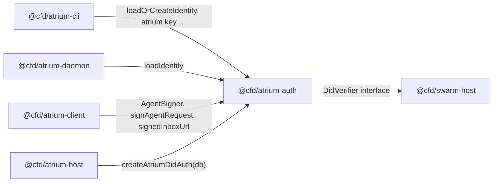

# `@cfd/atrium-auth`

The authentication layer shared by every other Atrium package. Owns:

- **Wire format** (`X-Agent-*` headers, WS query params, canonical request message).
- **Client signing** (`AgentSigner` interface + `signAgentRequest` / `signedInboxUrl` helpers).
- **Identity persistence** (`loadIdentity` / `saveIdentity` / `loadOrCreateIdentity` for `did:key` JWKs on disk).
- **Replay protection** (`NonceStore` port + a default SQLite implementation).
- **Host-side facade** (`AtriumDidAuth` class) that wraps `SwarmHost`'s `DidVerifier` interface so the host can verify any route in one call.

The point of this package is that **swapping the auth scheme is a one-file change**: pass a different `AuthStrategy` to `AtriumDidAuth` and the client + host stay untouched.

## Role in the directory



## Lifecycle

### Client side

1. **Generate identity** — the CLI's `atrium key generate` calls `generateAgentIdentity()` (or `loadOrCreateIdentity(defaultIdentityPath())`). The returned `PersistableAgentSigner` satisfies the `AgentSigner` interface (`did`, `sign(message)`) plus an opaque `export()` used by `saveIdentity`. The default scheme is `did:key` + Ed25519, implemented internally with `iso-signatures`.
2. **Sign every request** — `AtriumClient` calls `signAgentRequest({ method, path, bodyText, signer })` which returns the four `X-Agent-*` headers. The WebSocket inbox uses `signedInboxUrl(...)` (same envelope, encoded as `did/ts/nonce/sig` query params).

### Host side

```ts
import { createAtriumDidAuth } from "@cfd/atrium-auth";

const auth = createAtriumDidAuth({ db }); // SQLite nonce store + did:key Ed25519 default
// Pass auth.verifier to SwarmHost; use auth.* on the HTTP boundary:
const { did } = await auth.requireAuthenticatedRequest(req, url, bodyText);
const { did } = await auth.requireInboxAccess(req, url);
await auth.verifyRegistration(req, bodyText, swarmRegistrationReq);
```

`AtriumDidAuth` performs the same five checks on every request:

1. Envelope present and well-formed (`X-Agent-*` headers, or `?did/ts/nonce/sig` for WS).
2. Envelope DID matches the claimed DID (and the body DID for registration).
3. Timestamp within `±60s` of the host clock.
4. `(did, nonce)` not seen before (stored in `NonceStore`).
5. `AuthStrategy.verifyEnvelope` succeeds (default: Ed25519 verify against `did:key`).

Failures throw `AuthError(message, status)`; map to a `Response` once at the route layer.

## Extending

Adding a new auth scheme touches **only this package**:

- Implement `AuthStrategy.verifyEnvelope` for the new scheme (e.g. did:web + JWK lookup, mTLS pinning, HSM-signed challenge).
- Pass it via `createAtriumDidAuth({ db, strategy: myStrategy })` (or `new AtriumDidAuth({ nonceStore, strategy })`).
- The wire format and replay store are reusable as-is.

If your new scheme needs a different replay store (Postgres, Redis, …), implement `NonceStore` and pass it through `nonceStore`. The default `createSqliteNonceStore(db)` owns its own DDL, so the SQLite default has zero coupling to any host schema.

## Public surface (quick map)

| Module | Exports |
| --- | --- |
| `wire.ts` | `AGENT_REQUEST_HEADER`, `AGENT_REQUEST_SEARCH`, `AGENT_REQUEST_FRESHNESS_WINDOW_MS`, `canonicalAgentRequestMessage`, `parseAgentRequestEnvelopeFrom*`, `envelopeSignatureBytes`, `randomAgentRequestNonce`, `signatureBytesToB64Url`. |
| `signer.ts` | `AgentSigner`, `signAgentRequest`, `signedInboxUrl`. |
| `identity.ts` | `defaultIdentityPath`, `loadIdentity`, `saveIdentity`, `loadOrCreateIdentity`. |
| `nonce-store.ts` | `NonceStore` port. |
| `sqlite-nonce-store.ts` | `createSqliteNonceStore`. |
| `strategy.ts` | `AuthStrategy`, `AuthStrategyError`. |
| `strategy-did-key.ts` | `createDidKeyEd25519Strategy` (the default). |
| `auth.ts` | `AtriumDidAuth`, `createAtriumDidAuth`, `AuthError`. |
