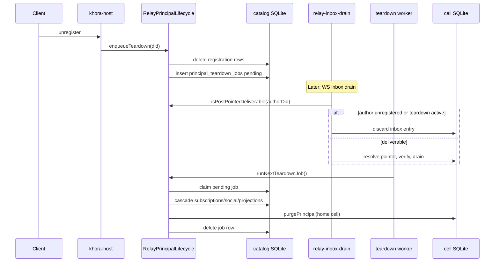

# Principal lifecycle

Khora principal unregister and inbox post-pointer deliverability are owned by **`RelayPrincipalLifecycle`** in `@khoralabs/relay-colonnade`.

```ts
const lifecycle = createRelayPrincipalLifecycle({ catalogDb, framesDb, projectionStore, ... });

lifecycle.enqueueTeardown(did);              // phase 1: drop registration, enqueue job
lifecycle.isPostPointerDeliverable(did);   // read-path gate for inbox drain
await lifecycle.runNextTeardownJob();        // phase 2: graph purge + cell purgePrincipal
lifecycle.cascadeTeardownNow(did);           // eager teardown (tests / admin)
```

Host wiring: one lifecycle instance on [`KhoraHostContext`](../packages/khora/host/src/context.ts), shared by catalog unregister, inbox drain, and the background worker.

## Flow



## Policy tiers

| Tier | Where | Rule |
|------|-------|------|
| **Lifecycle policy** | `RelayPrincipalLifecycle.isPostPointerDeliverable` | Author registered AND no active teardown job |
| **Storage verification** | `relay-inbox-drain.ts` | `OutboxGhostError`, hash mismatch, pool mismatch → discard row |

Lifecycle policy runs **before** pointer resolution. Storage verification runs **during** resolution.

## Job queue

Durable jobs live in `principal_teardown_jobs` on the relay catalog DB. Schema is ensured by `ensurePrincipalTeardownJobsSchema` at catalog open. Job CRUD is internal to the lifecycle module — not exported from `@khoralabs/relay-colonnade`.

## Extension

Grace periods, soft-delete authors, or delayed cell purge: add rules only to `RelayPrincipalLifecycle` (especially `isPostPointerDeliverable` and `runNextTeardownJob`). Colonnade `purgePrincipal` stays a generic storage primitive.

See also [`colonnade-usage.md`](../packages/khora/host/colonnade-usage.md) Tier 3 and [`system.md`](system.md).
