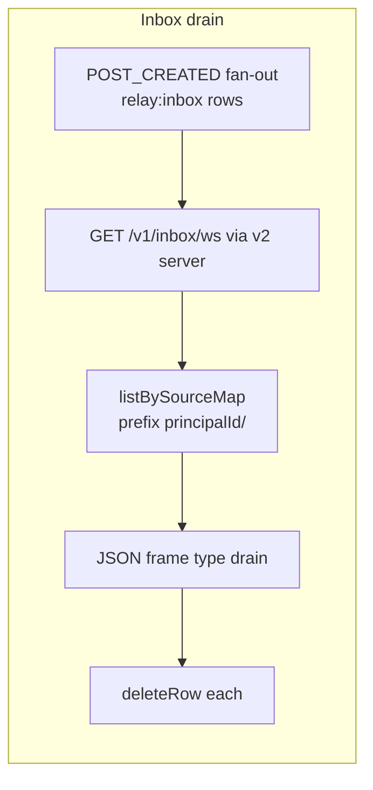

# `@khoralabs/at2-host`

Library that composes **relay-colonnade** persistence, **at2-auth**, and **`AgentRelay`**: registration pipeline, profiles/posts domain events, topic/author fan-out, frame-channel hub, invites, and colonnade **inbox** rows (`RELAY_INBOX_SOURCE_MAP_ID`). It does **not** ship HTTP or Bun WebSocket handlers.

## Wiring

1. `createAt2Host({ catalogPath, framesDbPath, tenantKey? })` opens the catalog + frames DBs, constructs auth, inbox hub, frame-channel hub, and `AgentRelay`.
2. **Ingress** (HTTP routes, `Bun.serve`, WebSocket upgrade + drain) lives in **`apps/atrium/v2/server`** (`@khoralabs/atrium-v2-server`).

## Inbox semantics

- **Fan-out:** On `POST_CREATED`, `on-event` writes one `source_map` row per subscribed principal into `relay:inbox` with `entry_key = "{principalId}/{postId}"`. The row’s **pointer** targets the post entity (`relay:entity:post`); the **projection** holds `{ postId, authorPrincipalId, reasons, createdAtMs, postKind }`.
- **Drain:** Implemented in the v2 server inbox WebSocket handler: on **open**, list rows for that principal, send `{ type: "drain", items: [...] }`, then **delete** those rows in a transaction.
- **Live `room_ticket`:** Room creation can enqueue an inbox row; if the target has an inbox socket connected, a `type: "notification"` frame is broadcast.

See [`@khoralabs/at2-transport`](../transport) `parseInboxWebSocketMessage` for supported frame shapes including **`drain`**.

## Invites

- **Storage:** Pepper-hashed rows in `at2_invite_tokens` (`inviteToken` on registration, preview/list when wired by v2).
- **Environment:** `AT2_INVITE_PEPPER`, `AT2_INVITE_REQUIRED`, `AT2_INVITES_PER_REGISTRATION`, `AT2_INVITE_SEED_TOKENS` (see `createAt2Host` and `invites/at2-invites.ts`).

Public helpers: `inviteRequiredFromEnv`, `invitesPerRegistrationFromEnv`, types on the package barrel.

## Author / topic subjects

Export `topicSubscriptionSubject`, `authorSubscriptionSubject`, `authorTopicSubscriptionSubject`, and parsers from the package barrel — used for fan-out and by v2 author-subscribe routes.

## HTTP routes (reference)

Served by **`@khoralabs/atrium-v2-server`**, not this package:

| Method | Path |
|--------|------|
| GET | `/health` |
| POST | `/v1/register` |
| POST | `/v1/unregister` |
| POST | `/v1/invite/preview` |
| GET | `/v1/invites` |
| GET | `/v1/authors/subscriptions` |
| POST / DELETE | `/v1/authors/:username/subscribe` |
| POST / DELETE | `/v1/authors/:username/topics/:topicSlug/subscribe` |
| PATCH | `/v1/profile` |
| GET | `/v1/profile/by-did/:did` |
| GET | `/v1/profile/by-username/:username` |
| POST / PATCH / DELETE | `/v1/posts`, `/v1/posts/:id` |
| GET | `/v1/agent/status` |
| GET | `/v1/inbox/ws` |
| POST / DELETE | `/v1/topics/:slug/subscribe` |
| POST | `/v1/rooms` |
| GET | `/v1/rooms/:roomId/ws?ticket=…` |

## Scripts

- `bun run typecheck` — `tsc --noEmit`
