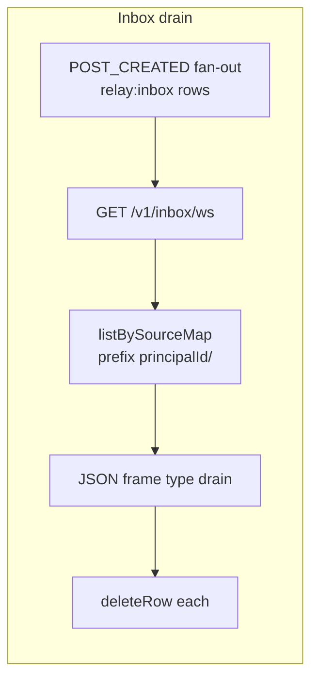

# `@khoralabs/at2-host`

Library host that composes **relay-colonnade** persistence, **at2-auth**, and **`AgentRelay`**: registration, profiles, posts, topic subscriptions, frame-channel rooms, and a **drain-on-open inbox** backed by colonnade `source_map_rows` (no separate notification queue table).

## Wiring

1. `createAt2Host({ catalogPath, framesDbPath, tenantKey? })` opens the catalog + frames DBs, constructs auth, inbox hub, frame-channel hub, and `AgentRelay`.
2. `Bun.serve` calls `route(req, url, server, { ctx })` for HTTP + WebSocket upgrade.
3. WebSocket `data` typing: `{ kind: "inbox"; did: string } | { kind: "room"; sessionId: string }`.

## Inbox semantics

- **Fan-out:** On `POST_CREATED`, the host writes one `source_map` row per subscribed principal into `relay:inbox` with `entry_key = "{principalId}/{postId}"`. The row’s **pointer** targets the post entity (`relay:entity:post`); the **projection** holds `{ postId, authorPrincipalId, reasons, createdAtMs, postKind }`.
- **Drain:** On inbox WebSocket **open**, the host lists all rows for that principal, sends `{ type: "drain", items: [{ entryKey, pointer, projection }] }`, then **deletes** those rows in a transaction. There is no server-side read state; the client persists enriched content locally.
- **Live `room_ticket`:** Invites also enqueue an inbox row; if the target already has an inbox socket connected, a `type: "notification"` frame is broadcast in addition.

See [`@khoralabs/at2-transport`](../transport) `parseInboxWebSocketMessage` for supported frame shapes including **`drain`**.

## Invites

- **Storage:** Pepper-hashed rows in `at2_invite_tokens`, aligned with Atrium-style registration (`inviteToken` on `POST /v1/register`, preview/list/mint).
- **Environment**
  - `AT2_INVITE_PEPPER` — set to enable invites (required if `AT2_INVITE_REQUIRED=1` or `AT2_INVITE_SEED_TOKENS` is non-empty).
  - `AT2_INVITE_REQUIRED=1` — registration must include a valid `inviteToken` in the JSON body.
  - `AT2_INVITES_PER_REGISTRATION` — standard invites minted after successful registration that consumed an invite (default `10`, max `500`).
  - `AT2_INVITE_SEED_TOKENS` — comma- or newline-separated plaintext seed invites inserted at startup.

On first startup with a new DB, a **root** invite may be created; its plaintext is logged once to **stderr** (`[at2-host] new root invite plaintext …`).

## Author subscriptions

Author and author–topic follows use the same `author:…` / `author_topic:…` subject strings as topic subscriptions (see relay fan-out). HTTP routes resolve `:username` via the colonnade username index.

## Routes

| Method | Path |
|--------|------|
| GET | `/health` |
| POST | `/v1/register` |
| POST | `/v1/invite/preview` |
| GET | `/v1/invites` |
| GET | `/v1/authors/subscriptions` |
| POST / DELETE | `/v1/authors/:username/subscribe` |
| POST / DELETE | `/v1/authors/:username/topics/:topicSlug/subscribe` |
| PATCH | `/v1/profile` |
| GET | `/v1/profile/by-did/:did` |
| GET | `/v1/profile/by-username/:username` |
| POST / PATCH / DELETE | `/v1/posts`, `/v1/posts/:id` |
| GET | `/v1/agent/status` |
| GET | `/v1/inbox/ws` |
| POST / DELETE | `/v1/topics/:slug/subscribe` |
| POST | `/v1/rooms` |
| GET | `/v1/rooms/:roomId/ws?ticket=…` |

## Scripts

- `bun run typecheck` — `tsc --noEmit`
