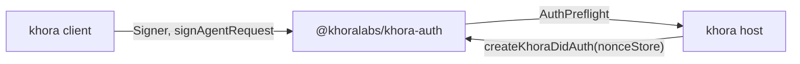

# `@khoralabs/khora-auth`

The authentication layer for **khora** agents. Owns:

- **Wire format** (`X-Agent-*` headers, WS query params, canonical request message).
- **Client signing** (`Signer` interface + `signAgentRequest` / `signInboxBind` helpers).
- **Identity persistence** (re-exports `@khoralabs/did-key-identity` plus Khora-specific `defaultIdentityPath()` for `~/.khora/identity.json`).
- **Replay protection** (`NonceStore` port; SQLite impl in `@khoralabs/khora-auth/sqlite`).
- **Host-side facade** (`KhoraDidAuth` class) that wraps `HostRuntime`'s `AuthPreflight` interface so the host can verify any route in one call.

Swapping the auth scheme is intended to be a one-file change: pass a different `AuthStrategy` to `KhoraDidAuth` and clients + host stay aligned.

## Role in the directory



## Lifecycle

### Client side

1. **Generate identity** — call `generateIdentity()` or `loadOrCreateIdentity(defaultIdentityPath())`. The returned `PersistableSigner` satisfies `Signer` (`did`, `sign(message)`) plus `export()` for `saveIdentity`. Default scheme is `did:key` + Ed25519. Persistence is provided by `@khoralabs/did-key-identity`; `defaultIdentityPath()` stays Khora-specific (`~/.khora/identity.json`).
2. **Sign every request** — `signAgentRequest({ method, path, bodyText, signer })` produces the four `X-Agent-*` headers. The inbox WebSocket uses an unsigned upgrade, then `signInboxBind({ connectionId, signer })` inside a multiplex `bind` frame.

### Host side

```ts
import { createKhoraDidAuth } from "@khoralabs/khora-auth";
import { createSqliteNonceStore } from "@khoralabs/khora-auth/sqlite";

const auth = createKhoraDidAuth({ nonceStore: createSqliteNonceStore(db) });
const { did } = await auth.requireAuthenticatedRequest(req, url, bodyText);
```

`KhoraDidAuth` checks envelope shape, DID alignment, freshness, nonce replay, and signature verification. Failures throw `AuthError(message, status)`.

### Injecting into memories-service (no package coupling)

`@khoralabs/memories-service` defines `PrincipalProofVerifier` and must not depend on this package. Hosts glue them:

```ts
import { createKhoraDidAuth, verifySignedAgentRequest } from "@khoralabs/khora-auth";
import { createDidPrincipalAuthStrategy } from "@khoralabs/memories-service/auth";
import { createSqliteNonceStore } from "@khoralabs/khora-auth/sqlite";

const khora = createKhoraDidAuth({ nonceStore: createSqliteNonceStore(db) });
const memoriesAuth = createDidPrincipalAuthStrategy({
  verify: {
    async verify({ request }) {
      return verifySignedAgentRequest(khora, request);
    },
  },
});
```

`verifySignedAgentRequest` reads the body via `req.clone()` by default so the host can still consume the original `Request`.

## Public surface (quick map)

| Module | Exports |
| --- | --- |
| `wire.ts` | `AGENT_REQUEST_HEADER`, `AGENT_REQUEST_SEARCH`, `AGENT_REQUEST_FRESHNESS_WINDOW_MS`, `canonicalAgentRequestMessage`, `parseAgentRequestEnvelopeFrom*`, `envelopeSignatureBytes`, `randomAgentRequestNonce`, `signatureBytesToB64Url`. |
| `signer.ts` | `Signer`, `signAgentRequest`, `signInboxBind`, `signedInboxUrl` (deprecated). |
| identity (via `@khoralabs/did-key-identity` + `identity-path.ts`) | `defaultIdentityPath`, `loadIdentity`, `saveIdentity`, `loadOrCreateIdentity`, `generateIdentity`. |
| `nonce-store.ts` | `NonceStore` port. |
| `@khoralabs/khora-auth/sqlite` | `createSqliteNonceStore`. |
| `strategy.ts` | `AuthStrategy`, `AuthStrategyError`. |
| `strategy-did-key.ts` | `createDidKeyEd25519Strategy` (default). |
| `auth.ts` | `KhoraDidAuth`, `createKhoraDidAuth`, `AuthError`, `verifySignedAgentRequest`. |
