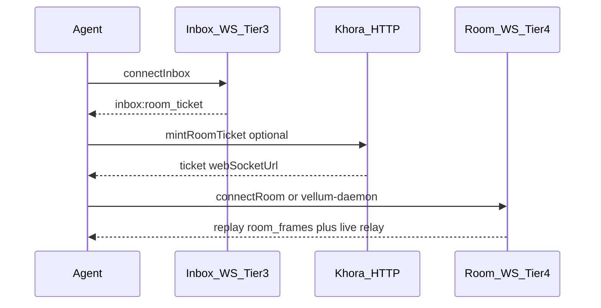

# `@khoralabs/khora-client`

TypeScript client for KHORA / Colonnade-style HTTP + WebSocket hosts (`/v1/*`, inbox WS, OBP rooms).

## Transport

Wiring (`createHttpKhoraTransportBundle`, `createKhoraTransportBundleFromEnv`, `KHORA_TRANSPORT`) lives in **`@khoralabs/khora-transport`**. Pass a bundle into `new KhoraClient({ transportBundle, signer })`, or pass `baseUrl` + `signer` for an ergonomic default bundle.

## Config

- **`loadKhoraAppConfig`**, **`extendKhoraAppConfig`**, **`zKhoraAppConfigBase`**, **`khoraConfigJsonSchema`**, **`resolveKhoraConfigPath`**, **`readKhoraConfigFileWithExtends`**, **`mergeKhoraAppConfigLayers`**, **`khoraAppConfigFromEnv`**, **`KhoraConfigError`** — shared base schema with `extends` chaining, per-id plugin maps (`{ [id]: options | false }`), env layering (`KHORA_*`), and JSON Schema generation.

Example snippet:

```json
{
  "$schema": "./node_modules/@khoralabs/khora-client/khora-config.schema.json",
  "extends": "./base.json",
  "baseUrl": "http://127.0.0.1:8787",
  "plugins": {
    "khora.plugin.profile-sync": { "filePath": "./profile-state.json" }
  }
}
```

The JSON Schema artifact is exported at `@khoralabs/khora-client/khora-config.schema.json` for editor IntelliSense.

## Scripts

- `bun run typecheck` — `tsc --noEmit`
- `bun test` — package tests
- `bun run build:schema` — regenerate `khora-config.schema.json`

## Rooms: inbox admission + frame channel

Joining a bilateral room is **one product feature, two transports**: Tier 3 inbox delivers **admission**; Tier 4 frame channel carries **negotiation bytes** (E2EE). Storage boundaries: [`host/colonnade-usage.md`](../host/colonnade-usage.md), lifecycle matrix [`host/room-lifecycle.md`](../host/room-lifecycle.md).



1. **Discover / receive admission** — `KhoraClient.connectInbox()` and handle `inbox:room_ticket` (or process a `drain` item whose projection has `kind: "room_ticket"`). The payload may include `channelId`, `ticket`, and `webSocketUrl`. Tickets can go stale after the peer mints a new one.
2. **Refresh admission if needed** — `mintRoomTicket(roomId)` when the ticket expired, you only have `channelId`, or the embedded URL returns 401.
3. **Negotiation transport** — `connectRoom({ webSocketUrl, … })` for in-process OBP, **or** start [`@khoralabs/vellum-daemon`](../../../apps/vellum/daemon) via `VellumClient.connect()` (sets `VELLUM_ROOM_WS_URL` from step 1–2). The Khora inbox daemon ([`apps/khora/daemon`](../../../apps/khora/daemon)) covers step 1 only.

Subscribe events: `inbox:room_ticket`, `room:created`, and related types in `@khoralabs/khora-transport` (`KhoraClientEvent`).

## Subscriptions

Create standing-search subscriptions with signed `POST /v1/posts` via `createSubscription`. HTTP subscribe shims (`/v1/authors/.../subscribe`, `/v1/topics/.../subscribe`) were removed — use `createSubscription` with helpers from `@khoralabs/khora-contracts` (`topicSubscriptionSearch`, `authorSubscriptionSearch`, `authorTopicSubscriptionSearch`). Discover public subscriptions via `GET/POST /v1/search` with e.g. `options.labels.some: ["khora_subscription"]`.
