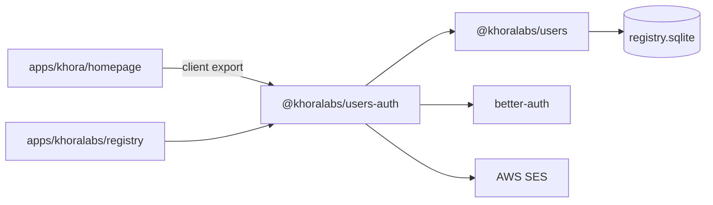

# `@khoralabs/users-auth`

Authentication layer for the **Khora registry**. Wraps [Better Auth](https://www.better-auth.com/) (email OTP sign-in) and syncs authenticated users into the domain model in [`@khoralabs/users`](../users).

## Role in the stack



Domain data (`accounts`, `memberships`, …) stays in `@khoralabs/users`. This package adds Better Auth tables, session handling, OTP delivery, and hooks that call `linkBetterAuthUser` when a user signs in.

## Exports

| Entry | Use |
| --- | --- |
| `@khoralabs/users-auth` | Server: auth instance, schema bootstrap, session helpers |
| `@khoralabs/users-auth/client` | Browser: `createUsersAuthClient`, `createRegistryEmailConfirmApi`, email-confirm types |

## Server setup

The registry app mounts Better Auth at `/api/auth` and runs combined migrations on startup:

```ts
import { ensureRegistrySchema, getRegistryAuth } from "@khoralabs/users-auth";

await ensureRegistrySchema();
const auth = getRegistryAuth();

// in fetch handler:
if (path.startsWith("/api/auth")) {
  return auth.handler(req);
}
```

`ensureRegistrySchema` applies `@khoralabs/users` migrations first, then Better Auth migrations (`1.0.0 → 2.0.0`).

## Browser client

```ts
import { createUsersAuthClient } from "@khoralabs/users-auth/client";

export const authClient = createUsersAuthClient({
  registryUrl: "http://localhost:4000",
});

// Email OTP sign-in (Better Auth emailOTP plugin)
await authClient.emailOtp.sendVerificationOtp({ email, type: "sign-in" });
await authClient.signIn.emailOtp({ email, otp });
```

Used by [`apps/khora/homepage`](../../../apps/khora/homepage) for `/login` via `@khoralabs/users-react` `EmailConfirm`.

## Email confirm API

For email → OTP flows (sign-in or sign-up), use the `EmailConfirmApi` interface and registry adapter instead of calling Better Auth methods directly:

```ts
import {
  createRegistryEmailConfirmApi,
  type EmailConfirmApi,
} from "@khoralabs/users-auth/client";

const api: EmailConfirmApi = createRegistryEmailConfirmApi({
  registryUrl: "http://localhost:4000",
  sourceApp: "my-app",
});

await api.sendOtp({ email, purpose: "sign-in" });
await api.verifyOtp({ email, otp, purpose: "sign-in" });
await api.confirmSession();
await api.subscribeMarketing?.({ email, listSlug: "updates", sourceApp: "my-app" });
```

| Method | Registry endpoint |
| --- | --- |
| `sendOtp` | `POST /api/auth/email-otp/send-verification-otp` |
| `verifyOtp` | `POST /api/auth/sign-in/email-otp` |
| `confirmSession` | `GET /api/auth/get-session` |
| `subscribeMarketing` | `POST /v1/marketing/subscribe` |

Both `purpose: "sign-in"` and `purpose: "sign-up"` map to Better Auth `type: "sign-in"` (new users are created on first OTP verification when `disableSignUp` is false). The purpose flag is app-level semantics for copy and marketing consent.

Pair with `@khoralabs/users-react` `EmailConfirm` compound for the UI flow — see [`users-react` README](../users-react/README.md).

## Session helpers

```ts
import { getRegistrySession, verifyRegistrySession } from "@khoralabs/users-auth";

// Same process as the registry server
const session = await getRegistrySession(req);

// Remote verification (forwards session cookie to registry)
const session = await verifyRegistrySession(req, {
  registryUrl: "http://localhost:4000",
});
```

## Environment

| Variable | Purpose |
| --- | --- |
| `BETTER_AUTH_SECRET` | Session signing secret (≥32 chars in production) |
| `REGISTRY_URL` / `BETTER_AUTH_URL` | Public base URL for auth callbacks |
| Host CORS trust (DB) | Per-host API + client app origins via admin; `resolveTrustedOrigins` in `createRegistryAuth` |
| `REGISTRY_COOKIE_DOMAIN` | Optional cross-subdomain cookie domain |
| `SES_FROM_ADDRESS` | OTP sender address |
| `AWS_REGION` | SES region |
| `REGISTRY_AUTH_OTP_LOG=1` | Log OTP to console instead of sending email (dev) |
| `REGISTRY_SQLCIPHER_KEY` | Inherited from `@khoralabs/users` (shared DB) |

Bootstrap staff emails (granted `role: "staff"`) are configured in `src/bootstrap.ts`.

## Public surface (quick map)

| Module | Exports |
| --- | --- |
| `auth-config.ts` | `createRegistryAuth`, `RegistryAuth`, `RegistryAuthOptions` |
| `auth.ts` | `getRegistryAuth`, `registryAuth` (lazy proxy) |
| `client.ts` | `createUsersAuthClient`, `createRegistryEmailConfirmApi`, email-confirm types |
| `email-confirm/types.ts` | `EmailConfirmApi`, `EmailConfirmPurpose`, … |
| `email-confirm/registry-api.ts` | `createRegistryEmailConfirmApi` |
| `db.ts` | `getRegistryDatabase` (alias of `getUsersDatabase`) |
| `ensure-schema.ts` | `ensureRegistrySchema`, `isRegistryAuthSchemaReady` |
| `schema.ts` | `authMigrations`, `registryMigrations`, `initRegistrySchema` |
| `session.ts` | `getRegistrySession`, `RegistrySession` |
| `verify-registry-session.ts` | `verifyRegistrySession` |
| `bootstrap.ts` | `isBootstrapStaffEmail`, `bootstrapStaffEmails` |
