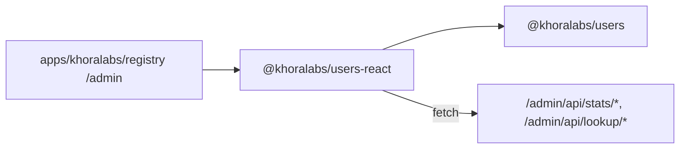

# `@khoralabs/users-react`

React compound components for the **Khora registry operator console** — network overview metrics, host list, and email lookup.

Depends on [`@khoralabs/users`](../users) for types only. Does **not** pull in Better Auth or server auth code.

## Role in the stack



The registry app protects admin routes with `@khoralabs/atrium-console` root-token sessions. These components assume an authenticated browser context and call the registry's admin JSON APIs.

## Compound API

`UsersStats` follows a compound-component pattern — compose primitives inside `UsersStats.Root`:

| Component | Purpose |
| --- | --- |
| `UsersStats.Root` | Provider + layout wrapper; configures API base URLs |
| `UsersStats.Overview` | Loading / error shell for summary data |
| `UsersStats.AccountsMetrics` | Account counts |
| `UsersStats.AccessRequestsMetrics` | Access-token request counts |
| `UsersStats.MarketingMetrics` | Marketing consent + membership counts |
| `UsersStats.HostList` | List of registered Atrium hosts |
| `UsersStats.HostListItem` | Single host row (used internally by `HostList`) |
| `UsersStats.EmailLookup` | Email lookup section wrapper |
| `UsersStats.EmailLookupForm` | Email input + search button |
| `UsersStats.EmailLookupResult` | Lookup result panel |

## Usage

```tsx
import { UsersStats } from "@khoralabs/users-react";

export function RegistryAdmin() {
  return (
    <UsersStats.Root
      baseUrl="/admin/api/stats"
      lookupBaseUrl="/admin/api/lookup"
      className="space-y-6"
    >
      <UsersStats.Overview>
        <UsersStats.AccountsMetrics />
        <UsersStats.AccessRequestsMetrics />
        <UsersStats.MarketingMetrics />
      </UsersStats.Overview>

      <UsersStats.HostList />

      <UsersStats.EmailLookup>
        <UsersStats.EmailLookupForm />
        <UsersStats.EmailLookupResult />
      </UsersStats.EmailLookup>
    </UsersStats.Root>
  );
}
```

See [`apps/khoralabs/registry/src/admin-ui/routes/admin/client.tsx`](../../../apps/khoralabs/registry/src/admin-ui/routes/admin/client.tsx) for a full example with cards and styling.

## Hooks and context

For custom layouts, use the hooks directly or read from context:

```tsx
import { useUsersStats } from "@khoralabs/users-react";

function CustomSummary() {
  const { summary, summaryLoading, refetchSummary } = useUsersStats();
  // ...
}
```

Lower-level hooks (without context):

- `useRegistrySummary(baseUrl, fetchImpl?)` — fetches `GET {baseUrl}/summary`
- `useRegistryEmailLookup(lookupBaseUrl, fetchImpl?)` — fetches `GET {lookupBaseUrl}/email?email=…`

## Styling

Components render semantic markup with `data-slot` attributes and minimal default styling. The host app supplies Tailwind (or other) classes on each compound part, as in the registry admin page.

Peer dependencies: `react`, `react-dom` (^19).

## Re-exported types

Domain types from `@khoralabs/users` are re-exported for convenience:

`Account`, `AtriumHost`, `AccessTokenRequest`, `MarketingConsent`, `RegistryAdminSummary`, `RegistryEmailLookupResponse`, and related lookup types.
