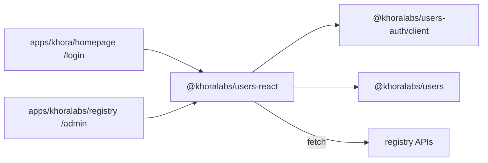

# `@khoralabs/users-react`

React compound components for the **Khora registry** — operator console stats/lookup and reusable **email → OTP confirmation** flows.

Depends on [`@khoralabs/users`](../users) for domain types and [`@khoralabs/users-auth`](../users-auth) for email-confirm API types.

## Role in the stack



## Email confirm flow

Headless email → OTP confirmation for sign-in or sign-up. Apps wire HTTP via `EmailConfirmApi` (typically `createRegistryEmailConfirmApi` from `@khoralabs/users-auth/client`) and supply UI through render props.

| Component | Purpose |
| --- | --- |
| `EmailConfirm.Root` | Provider; configures API, purpose, storage, marketing, onSuccess |
| `EmailConfirm.EmailStep` | Render prop for email entry (and optional marketing consent) |
| `EmailConfirm.OtpStep` | Render prop for OTP entry |

### Sign-in

```tsx
import { createRegistryEmailConfirmApi } from "@khoralabs/users-auth/client";
import { EmailConfirm } from "@khoralabs/users-react";

const api = createRegistryEmailConfirmApi({
  registryUrl: import.meta.env.BUN_PUBLIC_KHORA_REGISTRY_URL,
  sourceApp: "my-app",
});

<EmailConfirm.Root
  api={api}
  purpose="sign-in"
  storageKey="my-app-login-step"
  onSuccess={() => { window.location.href = "/"; }}
>
  <EmailConfirm.EmailStep>
    {(props) => <MyEmailForm {...props} />}
  </EmailConfirm.EmailStep>
  <EmailConfirm.OtpStep>
    {(props) => <MyOtpForm {...props} />}
  </EmailConfirm.OtpStep>
</EmailConfirm.Root>
```

### Sign-up with marketing consent

When `purpose="sign-up"` and `marketing` is set, the email step exposes `showMarketingConsent`, `marketingConsent`, and `setMarketingConsent`. On submit, marketing subscribe is called after OTP send (failures are logged, not blocking).

```tsx
<EmailConfirm.Root
  api={api}
  purpose="sign-up"
  marketing={{ listSlug: "khoralabs-updates", sourceApp: "my-app" }}
  onSuccess={(session) => { /* redirect */ }}
>
  {/* EmailStep render props include showMarketingConsent, marketingConsent, setMarketingConsent */}
</EmailConfirm.Root>
```

### Headless hook

For fully custom layouts:

```tsx
import { useEmailConfirmFlow } from "@khoralabs/users-react";

const flow = useEmailConfirmFlow({ api, purpose: "sign-in", onSuccess });
// flow.step, flow.sendOtp(), flow.verifyOtp(), …
```

See [`apps/khora/homepage/src/routes/login/client.tsx`](../../../apps/khora/homepage/src/routes/login/client.tsx) for a full example with shadcn UI.

---

## Operator console (`UsersStats`)

Compound components for the registry operator console — network overview metrics, host list, and email lookup.

`UsersStats` follows a compound-component pattern — compose primitives inside `UsersStats.Root`:

| Component | Purpose |
| --- | --- |
| `UsersStats.Root` | Provider + layout wrapper; configures API base URLs |
| `UsersStats.Overview` | Loading / error shell for summary data |
| `UsersStats.AccountsMetrics` | Account counts |
| `UsersStats.AccessRequestsMetrics` | Access-token request counts |
| `UsersStats.MarketingMetrics` | Marketing consent + membership counts |
| `UsersStats.HostList` | List of registered Khora hosts |
| `UsersStats.HostListItem` | Single host row (used internally by `HostList`) |
| `UsersStats.EmailLookup` | Email lookup section wrapper |
| `UsersStats.EmailLookupForm` | Email input + search button |
| `UsersStats.EmailLookupResult` | Lookup result panel |

## Usage

```tsx
import { UsersStats } from "@khoralabs/users-react";

export function RegistryAdmin() {
  return (
    <UsersStats.Root
      baseUrl="/admin/api/stats"
      lookupBaseUrl="/admin/api/lookup"
      className="space-y-6"
    >
      <UsersStats.Overview>
        <UsersStats.AccountsMetrics />
        <UsersStats.AccessRequestsMetrics />
        <UsersStats.MarketingMetrics />
      </UsersStats.Overview>

      <UsersStats.HostList />

      <UsersStats.EmailLookup>
        <UsersStats.EmailLookupForm />
        <UsersStats.EmailLookupResult />
      </UsersStats.EmailLookup>
    </UsersStats.Root>
  );
}
```

See [`apps/khoralabs/registry/src/admin-ui/routes/admin/client.tsx`](../../../apps/khoralabs/registry/src/admin-ui/routes/admin/client.tsx) for a full example with cards and styling.

## Hooks and context

For custom layouts, use the hooks directly or read from context:

```tsx
import { useUsersStats } from "@khoralabs/users-react";

function CustomSummary() {
  const { summary, summaryLoading, refetchSummary } = useUsersStats();
  // ...
}
```

Lower-level hooks (without context):

- `useRegistrySummary(baseUrl, fetchImpl?)` — fetches `GET {baseUrl}/summary`
- `useRegistryEmailLookup(lookupBaseUrl, fetchImpl?)` — fetches `GET {lookupBaseUrl}/email?email=…`

## Styling

Components render semantic markup with `data-slot` attributes and minimal default styling. The host app supplies Tailwind (or other) classes on each compound part, as in the registry admin page.

Peer dependencies: `react`, `react-dom` (^19).

## Re-exported types

Domain types from `@khoralabs/users` and email-confirm types from `@khoralabs/users-auth/client` are re-exported for convenience:

`Account`, `KhoraHost`, `AccessTokenRequest`, `MarketingConsent`, `RegistryAdminSummary`, `RegistryEmailLookupResponse`, `EmailConfirmEmailStepRenderProps`, `EmailConfirmOtpStepRenderProps`, and related lookup types.
