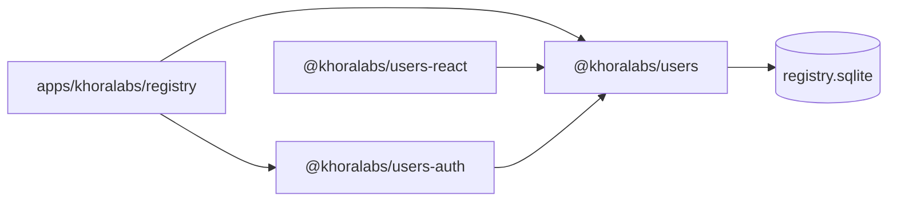

# `@khoralabs/users`

Domain and persistence layer for the **Khora registry** — network-level user data stored in encrypted SQLite (`registry.sqlite`).

Owns accounts, emails, auth provider links, Khora hosts, memberships, access-token requests, and marketing consents. Does **not** implement sign-in; that lives in [`@khoralabs/users-auth`](../users-auth).

## Role in the stack



| Package | Responsibility |
| --- | --- |
| `@khoralabs/users` | Domain schema, queries, migrations (`0.0.0 → 1.0.0`) |
| `@khoralabs/users-auth` | Better Auth integration, OTP, sessions |
| `@khoralabs/users-react` | Operator admin UI compound components |

## Schema

Domain tables (see `src/schema-sql.ts`):

| Table | Purpose |
| --- | --- |
| `accounts` | Canonical registry account |
| `account_emails` | Verified email addresses per account |
| `auth_links` | Maps external auth subjects (e.g. Better Auth user id) to accounts |
| `khora_hosts` | Federated Khora host catalog (`pending` → `active` via operator activate) |
| `memberships` | Account ↔ host relationships (`agent_did` links operator agents) |
| `device_authorizations` | CLI device-flow sessions (RFC 8628-style) |
| `cli_link_challenges` | One-time agent signature challenges for `khora link` |
| `access_token_requests` | Email-based access-token invite flow |
| `marketing_consents` | Opt-in / opt-out per list |

Auth provider tables (`user`, `session`, `verification`, …) are owned by `@khoralabs/users-auth` migrations.

## Database

```ts
import { getUsersDatabase, initUsersSchema } from "@khoralabs/users";

const db = getUsersDatabase();
await initUsersSchema(db);
```

| Env var | Purpose |
| --- | --- |
| `REGISTRY_DATABASE_PATH` | SQLite path (default: `packages/khoralabs/users/data/registry.sqlite`; use `:memory:` in tests) |
| `REGISTRY_SQLCIPHER_KEY` | SQLCipher encryption key (≥16 chars, required) |

## Public surface (quick map)

| Module | Exports |
| --- | --- |
| `accounts.ts` | `findAccountById`, `findAccountByEmail`, `findAccountByAuthSubject`, `linkBetterAuthUser`, `mergeEmailOntoAccount`, `listAccountEmails` |
| `access-token-requests.ts` | `createAccessTokenRequest`, `findAccessTokenRequest`, `listAccessTokenRequestsForEmail`, `markAccessTokenMinted`, `markAccessTokenSent`, … |
| `khora-hosts.ts` | `registerKhoraHost`, `activateKhoraHost`, `listPublicHosts`, `findActiveHostBySlug`, `seedDefaultHost`, … |
| `host-slug.ts` | `normalizeHostSlug` validation |
| `host-url.ts` | `normalizeKhoraHostBaseUrl`, `findHostByBaseUrl` (loopback alias aware) |
| `memberships.ts` | `upsertMembership`, `setMembershipAgentDid`, `listMembershipsForAccount`, … |
| `device-authorizations.ts` | Device flow for `khora link` browser approval |
| `cli-link-challenges.ts` | Agent proof challenges for link API |
| `marketing-consents.ts` | `subscribeMarketing`, `unsubscribeMarketing`, `listMarketingConsentsForEmail`, … |
| `admin-stats.ts` | `getRegistryAdminSummary`, `lookupRegistryByEmail`, `lookupRegistryByAccountId` |
| `db.ts` | `getUsersDatabase`, `registryDatabasePath`, `resetUsersDatabase` |
| `schema.ts` | `usersMigrations`, `initUsersSchema`, `isUsersSchemaReady` |
| `types.ts` | `Account`, `KhoraHost`, `AccessTokenRequest`, `MarketingConsent`, admin lookup types |

## Host catalog lifecycle

1. **`POST /v1/hosts/register`** (registry) — inserts `khora_hosts` with `status: pending`.
2. **`POST /internal/v1/hosts/:id/activate`** — bearer `REGISTRY_INTERNAL_SECRET` promotes to `active`.
3. **`GET /v1/hosts`** — public discovery (active hosts only).

CLI: `khora host list`, `khora host use <slug>`, `khora host register` (submits pending registration).

## Usage

```ts
import {
  findAccountByEmail,
  getUsersDatabase,
  subscribeMarketing,
} from "@khoralabs/users";

const db = getUsersDatabase();
const account = findAccountByEmail(db, "user@example.com");

subscribeMarketing(db, {
  email: "user@example.com",
  listSlug: "product-updates",
  sourceApp: "homepage",
});
```

## Tests

```bash
bun test
```
